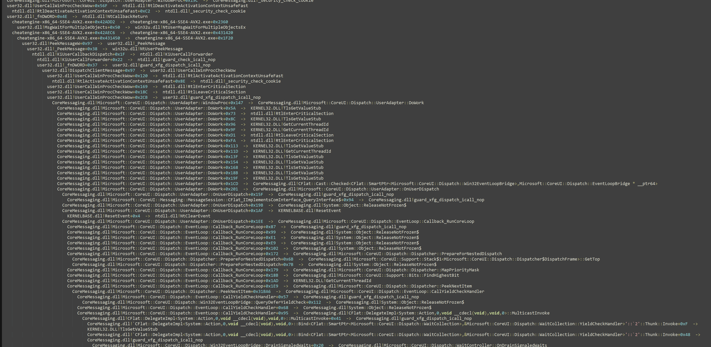

# UltimapMax 
本项目旨在通过 intel PT 解决某开源项目的一些弊端
通过UltimapMax可以将原本卡顿的现象提升15000倍以上

0. AMD 不受支持，基于 intel PT
1. winipt 新增了 intel ipt的支持 (non-nt)
2. 本项目目前完全属于纯c而非c++ 
3. 目前只是半成品 ，后续会完善

-- 本项目由 狮极 重新创建 

## Screenshot

